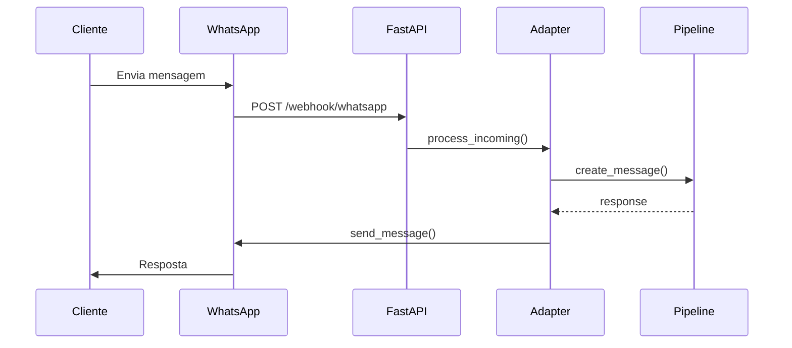

# WhatsApp Business API Integration

> **Versão Target:** V1.1
> **Status:** ⏳ Pendente
> **Owner:** Unassigned
> **Estimativa:** 20h

---

## Descrição

Integração com WhatsApp Business API para receber e enviar mensagens de clientes via WhatsApp, seguindo o mesmo padrão do TelegramAdapter existente.

---

## Passos de Implementação

### 1. Código

- [ ] `src/adapters/whatsapp_adapter.py` - Adapter principal (6h)
  - Webhook handler para mensagens recebidas
  - Envio de mensagens (texto, mídia)
  - Tratamento de status de mensagens
- [ ] `src/api/whatsapp_routes.py` - Endpoints webhook (2h)
  - Verificação de webhook (GET)
  - Recebimento de mensagens (POST)
- [ ] `src/models/whatsapp.py` - Modelos Pydantic (1h)
- [ ] Atualizar `main.py` para incluir routes

### 2. Testes

- [ ] `tests/unit/test_whatsapp_adapter.py` - Unit tests (3h)
- [ ] `tests/integration/test_whatsapp_e2e.py` - E2E flow (4h)
- [ ] Mock server para simular WhatsApp API

### 3. Documentação

- [ ] `docs/WHATSAPP_SETUP.md` - Guia de configuração (2h)
  - Meta Business verification
  - App creation
  - Webhook configuration
  - Environment variables

### 4. Infraestrutura

- [ ] Meta Business Account verification
- [ ] WhatsApp Business App creation
- [ ] Phone number registration
- [ ] Environment variables: `WHATSAPP_TOKEN`, `WHATSAPP_VERIFY_TOKEN`, `WHATSAPP_PHONE_ID`

---

## Dependências

- V1.0 deve estar completo (infra básica estável)
- Meta Business Account verificado

---

## Arquivos Novos

```
src/
├── adapters/
│   └── whatsapp_adapter.py    # NEW
├── api/
│   └── whatsapp_routes.py     # NEW
└── models/
    └── whatsapp.py            # NEW

docs/
└── WHATSAPP_SETUP.md          # NEW

tests/
├── unit/
│   └── test_whatsapp_adapter.py
└── integration/
    └── test_whatsapp_e2e.py
```

---

## Fluxo de Mensagens



---

## Referências

- [WhatsApp Business API Docs](https://developers.facebook.com/docs/whatsapp/)
- [Webhook Setup Guide](https://developers.facebook.com/docs/whatsapp/cloud-api/guides/set-up-webhooks)
- [TelegramAdapter existente](../../src/adapters/telegram_adapter.py) - Referência de implementação
